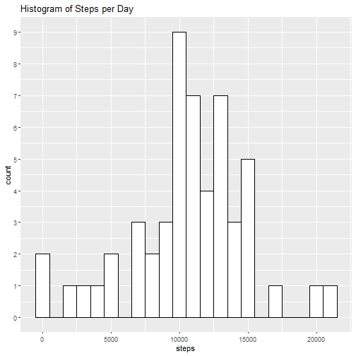
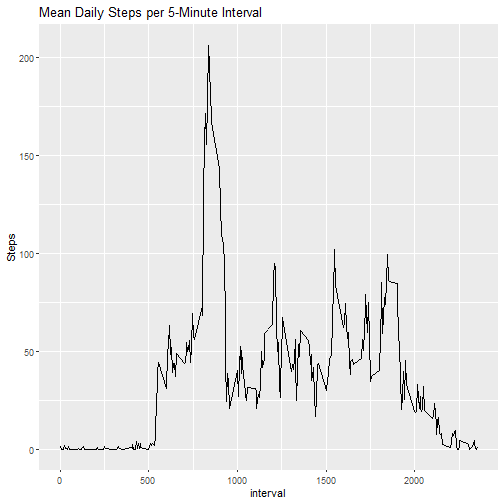
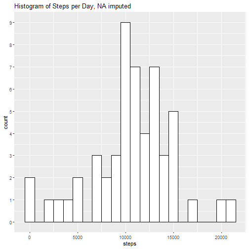
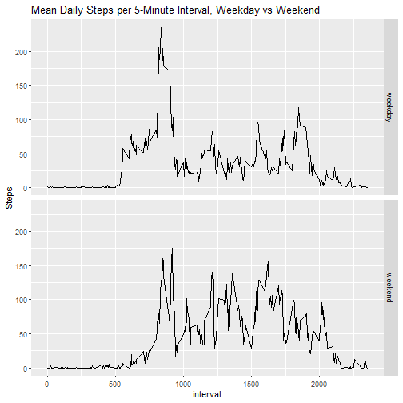

Reproducible Research Assignment #1
===================================
Phil Renner


## Read activity data

Start with activity data from https://d396qusza40orc.cloudfront.net/repdata%2Fdata%2Factivity.zip


```r
activity <- read.csv("activity.csv")
library(dplyr)
library(ggplot2)
```

## What is mean total number of steps taken per day?  
For this part of the assignment, you can ignore the missing values in the dataset.

1. Make a histogram of the total number of steps taken each day

2. Calculate and report the mean and median total number of steps taken per day


```r
#aggregate steps per day
dailysteps <-   activity %>% 
     group_by(date) %>%
     summarise_all("sum")

#plot histogram of steps per day
g <- ggplot(data = dailysteps, aes(x=steps), theme_gray())
g+ geom_histogram(binwidth = 1000, color= "black", fill = "white") + labs(title = "Histogram of Steps per Day") + scale_y_continuous(breaks = seq(0, 10, by = 1))
```

```
## Warning: Removed 8 rows containing non-finite values (stat_bin).
```



```r
#calculate mean, median, and quartiles for stepe
summary(dailysteps$steps)
```

```
##    Min. 1st Qu.  Median    Mean 3rd Qu.    Max.    NA's 
##      41    8841   10765   10766   13294   21194       8
```

## What is the average daily activity pattern?  
1. Make a time series plot (i.e. type = "l") of the 5-minute interval (x-axis) and the average number of steps taken, averaged across all days (y-axis)

2. Which 5-minute interval, on average across all the days in the dataset, contains the maximum number of steps?


```r
#create summary df grouped by interval
dailypattern <-   activity %>% 
     group_by(interval) %>%
     summarise(meansteps=mean(steps, na.rm = TRUE))
```

```
## `summarise()` ungrouping output (override with `.groups` argument)
```

```r
#line plot of 5-minute intervals
g<- ggplot(data = dailypattern, aes(x=interval, y=meansteps))
g+ geom_line() + labs(title = "Mean Daily Steps per 5-Minute Interval") +ylab("Steps")
```



```r
maxsteps <- dailypattern[which(dailypattern$meansteps == max(dailypattern$meansteps)),]
```
*Interval with maximum average number of steps is Interval number 835 with 206.1698113 steps on average*


## Imputing missing values  
Note that there are a number of days/intervals where there are missing values (coded as NA). The presence of missing days may introduce bias into some calculations or summaries of the data.

1.Calculate and report the total number of missing values in the dataset (i.e. the total number of rows with NAs)

2.Devise a strategy for filling in all of the missing values in the dataset. The strategy does not need to be sophisticated. For example, you could use the mean/median for that day, or the mean for that 5-minute interval, etc.

3.Create a new dataset that is equal to the original dataset but with the missing data filled in.

4.Make a histogram of the total number of steps taken each day and Calculate and report the mean and median total number of steps taken per day. Do these values differ from the estimates from the first part of the assignment? What is the impact of imputing missing data on the estimates of the total daily number of steps?


```r
#count the number of days where steps is na
nacount <- sum(is.na(activity$steps))
#print("There are", nacount, "intervals with NA")

#impute the missing values with the mean from that 5-minute interval
impsteps <- activity %>% 
     group_by(interval) %>% 
     mutate(imputed = ifelse(is.na(steps), mean(steps, na.rm = TRUE), steps))

#aggregate steps per day, using imputed data
dailysteps2 <-   impsteps %>% 
     group_by(date) %>%
     summarise_all("sum")

#plot histogram of steps per day
g <- ggplot(data = dailysteps2, aes(x=steps), theme_gray())
g+ geom_histogram(binwidth = 1000, color= "black", fill = "white") + labs(title = "Histogram of Steps per Day, NA imputed") + scale_y_continuous(breaks = seq(0, 10, by = 1))
```

```
## Warning: Removed 8 rows containing non-finite values (stat_bin).
```



```r
#calculate mean, median, and quartiles for steps, using imputed data
summary(dailysteps2$steps)
```

```
##    Min. 1st Qu.  Median    Mean 3rd Qu.    Max.    NA's 
##      41    8841   10765   10766   13294   21194       8
```
*Commentary:  
Since I imputed the NA values with interval averages, the mean and median steps per day did not change.*


## Are there differences in activity patterns between weekdays and weekends?  
For this part the weekdays() function may be of some help here. Use the dataset with the filled-in missing values for this part.

Create a new factor variable in the dataset with two levels -- "weekday" and "weekend" indicating whether a given date is a weekday or weekend day.

Make a panel plot containing a time series plot (i.e. type = "l") of the 5-minute interval (x-axis) and the average number of steps taken, averaged across all weekday days or weekend days (y-axis).


```r
#add a column for day of week, then another for weekday/weekend
impsteps$weekday <- weekdays(as.Date(impsteps$date))
impsteps$dow <- ifelse(impsteps$weekday %in% c("Saturday", "Sunday"), "weekend", "weekday")

#aggregate steps per interval and weekday/weekend using imputed data
dailypat2 <-   impsteps %>% 
     group_by(dow, interval) %>%
     summarise(meansteps=mean(steps, na.rm = TRUE))
```

```
## `summarise()` regrouping output by 'dow' (override with `.groups` argument)
```

```r
#line plot of 5-minute intervals comparing weekday vs weekend
g<- ggplot(data = dailypat2, aes(x=interval, y=meansteps))
g+ geom_line() + labs(title = "Mean Daily Steps per 5-Minute Interval, Weekday vs Weekend") +
  ylab("Steps") + facet_grid(dow ~ .)
```


